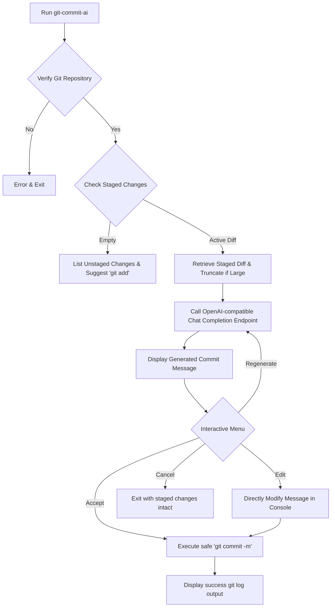

# ✨ git-commit-ai

[](LICENSE)
[](package.json)
[](https://conventionalcommits.org)
[](https://github.com/your-username/git-commit-ai/pulls)

`git-commit-ai` is an interactive CLI companion designed to streamline your Git workflow. By analyzing your staged modifications (`git diff`), it crafts precise, clear, and standard-compliant commit messages conforming to the **Conventional Commits** specification. 

Say goodbye to vague `"fix bugs"` or `"update files"` commit messages. Let AI write high-quality commit histories for your codebase.

---

## ⚡ Key Features

* **Interactive Workflow**: Confirm, edit, regenerate, or abort your commit directly from a beautiful terminal interface.
* **Standard Conformance**: Generates messages in the industry-standard Angular convention (`feat(scope): message`).
* **OpenAI-Compatible Engine**: Works out-of-the-box with OpenAI, but supports any OpenAI-compatible custom endpoints (e.g., DeepSeek, Groq, local Llama instances via Ollama).
* **Safe & Transparent**: Zero shell-escape risks. Staged diffs are processed directly, and the message is passed as arguments directly to the Git executable.
* **Size Guard**: Automatically detects massive diffs and truncates safe chunks to respect API token window limits.

---

## 🔄 Visual Workflow



---

## 🚀 Installation

Ensure you have **Node.js >= 20.0.0** and **Git** installed on your system.

### Local Install (for development)
1. Clone your repository:
   ```bash
   git clone https://github.com/YOUR_USERNAME/git-commit-ai.git
   cd git-commit-ai
   ```
2. Install dependencies:
   ```bash
   npm install
   ```
3. Link the package globally:
   ```bash
   npm link
   ```
   *Now you can run the tool globally using either `git-commit-ai` or the shorthand `gca`!*

---

## ⚙️ Configuration

Configure your AI endpoint and keys using the built-in configuration manager:

### 1. Set your API Key (Required)
```bash
git-commit-ai config --set apiKey=sk-proj-xxxxxxxxxxxxxxxxxxxxx
```

### 2. Set Custom API Endpoint (Optional)
If you want to use a third-party endpoint (e.g., DeepSeek, OpenRouter, or a local server):
```bash
git-commit-ai config --set apiBase=https://api.deepseek.com/v1
git-commit-ai config --set model=deepseek-chat
```

### 3. Check configuration details
```bash
git-commit-ai config --list
```
This will print your API endpoint, masked API key, model target, and style settings.

---

## 📖 Usage Guide

Make some code modifications in your project, then follow these three simple steps:

### Step 1: Stage your files
```bash
git add src/auth.js
```

### Step 2: Invoke the helper
```bash
git-commit-ai
# or simply:
gca
```

### Step 3: Interactive Selection
The tool will show you which files are staged, analyze the modifications, display a loading spinner, and output the proposed conventional commit:

```text
✨ Git Commit AI v1.0.0
Analyzing staged changes to write your commit message...

✓ Found 1 staged file(s):
  • src/auth.js

✔ Commit message generated successfully!

──────────────────────────────────────────────────────────────────────
feat(auth): add JWT expiration verification and refresh tokens logic

- Implemented token expiry checks inside standard middleware
- Integrated dynamic sliding session extensions
──────────────────────────────────────────────────────────────────────

? Select action for this message:
> Accept and Commit
  Edit message manually
  Regenerate message
  Cancel
```

---

## 🛡️ License

Distributed under the MIT License. See [LICENSE](LICENSE) for more information.
